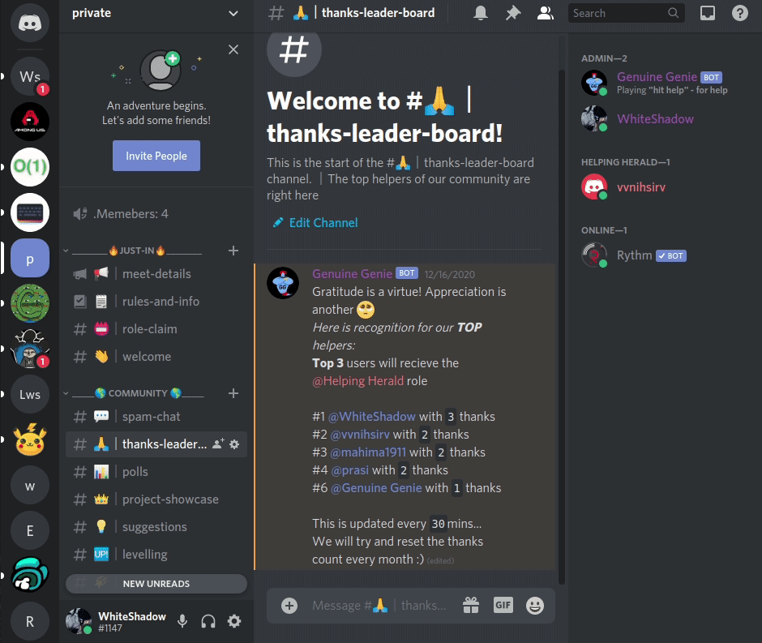
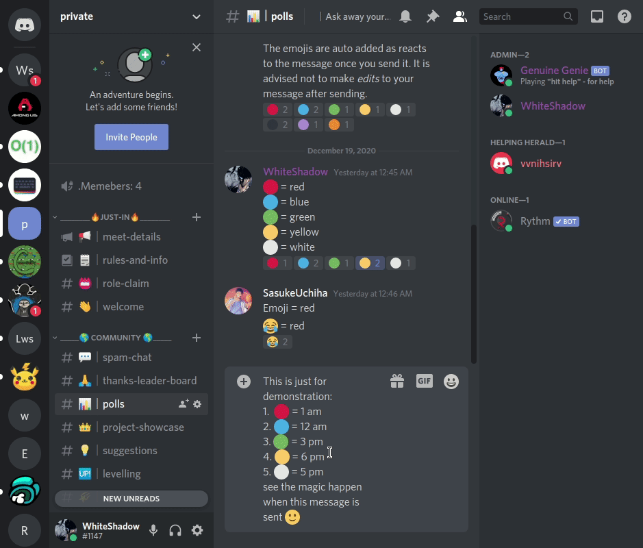
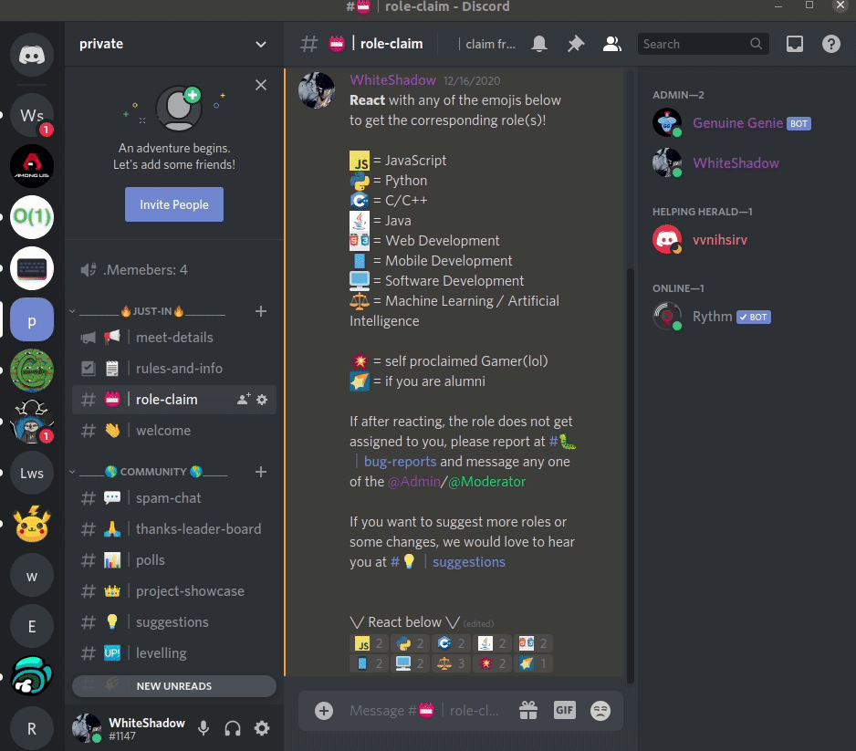
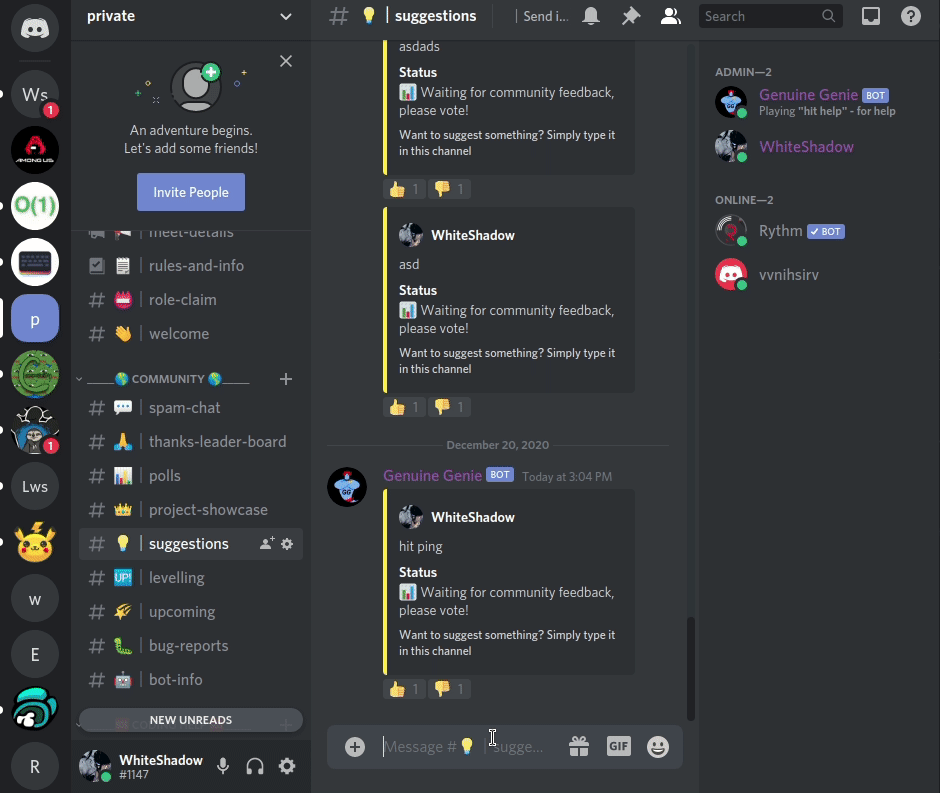
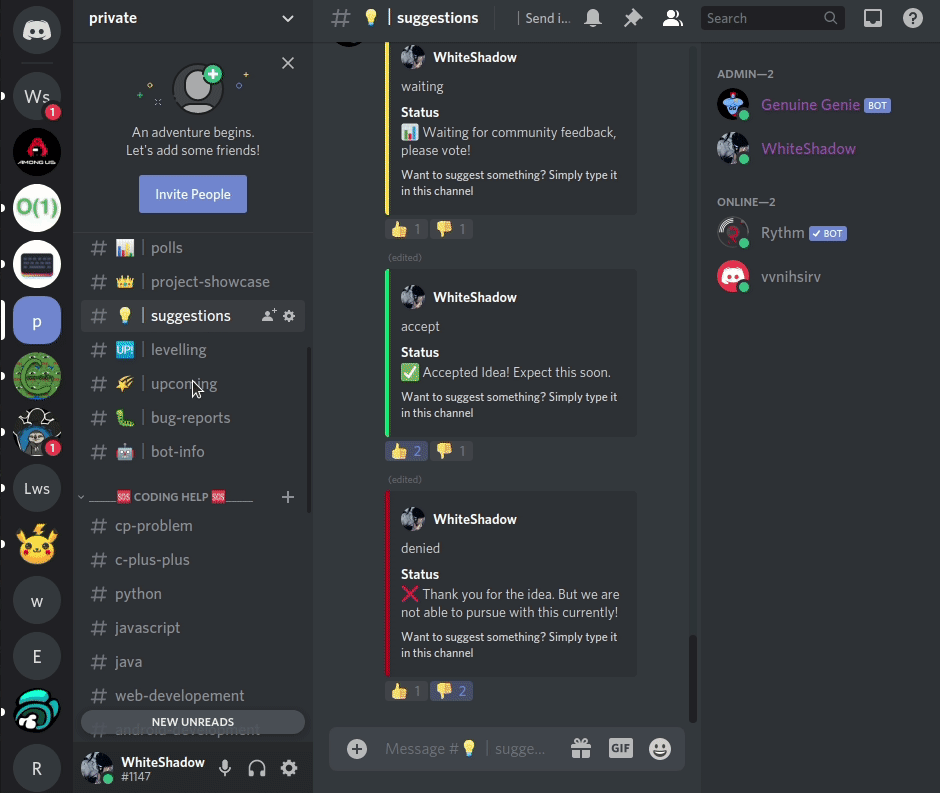
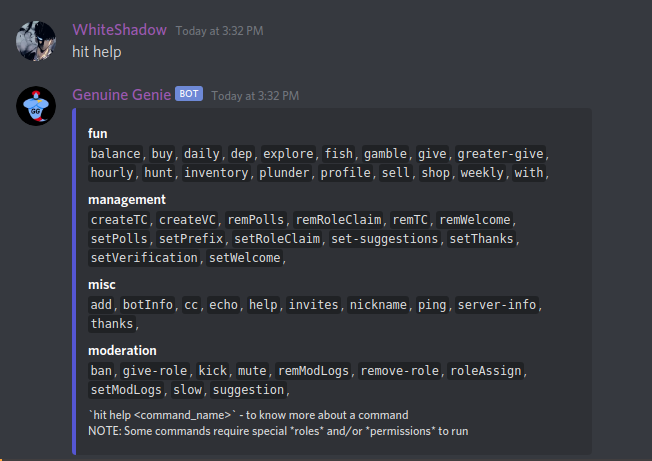
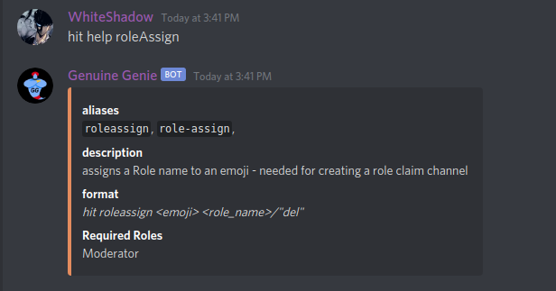

# discord-bot-GenuineGenie

A bot that can do everything? Yes you read that right, this is as advanced community server _setup/management/moderation/handling_ discord-bot with about **50+ commands** and **10+ features**!!

Invite the bot by clicking on this URL right now, and see it in action yourself, [click here](https://discord.com/api/oauth2/authorize?client_id=786230987964809257&permissions=8&scope=bot)

---

# Features

-   ## Welcome

    -   set up any channel as a welcome channel with your own custom message.
    -   When anyone joins, the bot will auto greet with your custom text
    -   _the inbuilt tool that discord provides doesnt let you @ the user that joins_
        

-   ## Thank's Leaderboard

    -   set up any channel with the thank's leaderboard
    -   The top 30 people who have been thanked will be displyed in this channel, refreshing every 30 mins
    -   _This is a fun way to motivate your server members to help out others, incase you are building a server that would require this use case_
        

-   ## Polls

    -   set up any channel to auto-poll any message sent
    -   When someone sends a message `<emoji> = <content>`, the bot will audo add those emojis to the message sent. So people can now easily voice their opinions by simply reacting to the message.
    -   _Do you have a server which requires a lot of community opinion? Or do you want to ask a simple question like when you want to hold your next meeting? Just use the polls channel_
        

-   ## Role-Claim

    -   Set up any channel as the role-claim channel
    -   Once you finish up assigning roles to emojis, you can create a role claim channel with the syntax `<emoji> = <content>`, and leave the bot to take care of the rest
    -   emojis that represent roles are automatically added
    -   and then comes the Magical part!! When people react, they **GET THE ROLE**!
    -   This is a **premium** feature in many well known bots, offered for free in GG
    -   _handy tool to nail your first impression, especially if you are building a community server_
        

-   ## Suggestions Channel

    -   Set up any channel as the role-claim channel
    -   Once set up, any message you send here will be auto styled into an aesthetic template awaiting community feedback
    -   Moderators can then accept or deny a suggestion with basic commands
    -   _Extremely handy to get and process communtiy suggestions and giving feedback to each. If everything was just a boring text channel, would'nt it be broing?_
        

-   ## Mod-logs

    -   Set up any channel to log everything that a person with the role 'Moderator' would say
    -   Effective tool to moderate anything and everything that a 'Moderator' says in your server
    -   _If you are building a big community with many unknown temporary mods, this is the right feature for you_
        

-   ## Per server Prefix

    -   run a simple `<current_prefix> prefix <new_prefix>` and set a prefix of your choice for youur server
    -   _Often used by guild masters to stop 2 or more bots from having the same command prefix_

-   ## Member Count (coming soon...)

    -   Set up any channel to display the number of people in your server
    -   you can see the member count channel in any of the above gifs
    -   _Want to show off the enormous amount of people in your server or just you know display useful information, then this is your goto feature_

# Commands

There are over **50 commands** that is offered by the bot. The differnt commands can be seen in the pic below.

-   #### As it is shown, the commadns are widely divided into _4 categories_, namely,

    -   **fun** - comers with levelling and economy systems (**MUST CHECK OUT**)
    -   **management** - commands that implement features and much more
    -   **misc** - random ad hoc commands for curious minds
    -   **moderation** - moderators rule over these commands

-   You can type `hit help <command_name>` anytime to get a detailed description of any command like below,
    !

## **NOTE**

The **fun commands** are _very vast_ and includes some amazing **premium** features like `daily`, `battles`, `levelling`, `shop`, `buy`, `sell` and much more. These commmands will surely increase your _server activity by 3 folds_ if used properly. [_**MUST CHECK OUT FEATURE**_]
